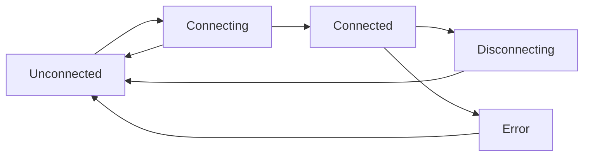

## Overview

Wallet management is at the heart of any Solana dApp. Hermis provides a comprehensive system for managing wallet connections, state, and interactions across all supported wallets.

## Wallet Lifecycle



### States

<CardGroup cols={2}>
  <Card title="Unconnected" icon="circle">
    No wallet is connected. User needs to select and connect a wallet.
  </Card>
  <Card title="Connecting" icon="spinner">
    Connection in progress. Waiting for user approval in wallet.
  </Card>
  <Card title="Connected" icon="check-circle">
    Wallet successfully connected. Can perform transactions.
  </Card>
  <Card title="Disconnecting" icon="circle-xmark">
    Disconnection in progress. Cleaning up resources.
  </Card>
</CardGroup>

## Supported Wallets

Hermis supports any wallet that implements the [Wallet Standard](https://github.com/wallet-standard/wallet-standard). This includes browser extension wallets, mobile wallets, and hardware wallets that conform to the standard.

## Wallet Detection

The SDK automatically detects installed wallets and groups them by ready state:

```typescript
import { useWalletAdapters } from '@hermis/solana-headless-react';

function WalletList() {
  const { installed, loadable, notDetected, all } = useWalletAdapters();

  // installed: Wallets detected in browser
  // loadable: Wallets that can be loaded on demand
  // notDetected: Wallets not installed
  // all: All adapters sorted by priority

  return (
    <>
      {installed.map(adapter => (
        <div key={adapter.name}>{adapter.name} (Installed)</div>
      ))}
    </>
  );
}
```

### Ready States

<ParamField path="Installed" type="ReadyState">
  Wallet is installed and detected in the user's browser
</ParamField>

<ParamField path="Loadable" type="ReadyState">
  Wallet can be loaded on demand (e.g., WalletConnect)
</ParamField>

<ParamField path="NotDetected" type="ReadyState">
  Wallet is not installed or detected
</ParamField>

<ParamField path="Unsupported" type="ReadyState">
  Wallet is not supported in current environment
</ParamField>

## Connection Management

### Manual Connection

```typescript
// React
import { useWallet } from '@hermis/solana-headless-react';

function ConnectButton() {
  const { connect, select } = useWallet();

  const handleConnect = async () => {
    select('Phantom'); // Select wallet
    await connect();    // Connect to wallet
  };

  return <button onClick={handleConnect}>Connect</button>;
}
```

```javascript
// Vanilla JS
import { WalletAdapterManager } from '@hermis/solana-headless-adapter-base';

const manager = new WalletAdapterManager(adapters);

manager.selectAdapter('Phantom');
await manager.connect();
```

### Auto-Connect

Automatically reconnect to the last used wallet on page load:

```tsx
<HermisProvider autoConnect={true}>
  {children}
</HermisProvider>
```

This provides a seamless experience for returning users.

## Wallet Selection

### Building a Wallet Selector

```tsx
import { useWallet, useWalletAdapters } from '@hermis/solana-headless-react';

function WalletSelector() {
  const { select, connect } = useWallet();
  const { installed, notDetected } = useWalletAdapters();

  return (
    <div>
      <h3>Installed Wallets</h3>
      {installed.map(adapter => (
        <button
          key={adapter.name}
          onClick={() => {
            select(adapter.name);
            connect();
          }}
        >
          {adapter.icon && }
          {adapter.name}
        </button>
      ))}

      <h3>Other Wallets</h3>
      {notDetected.map(adapter => (
        <button
          key={adapter.name}
          onClick={() => window.open(adapter.url, '_blank')}
        >
          {adapter.name} (Not Installed)
        </button>
      ))}
    </div>
  );
}
```

## Persistence

### Local Storage

Wallet selection is automatically persisted to local storage:

```tsx
<HermisProvider
  storageKey="my-app-wallet" // Custom storage key
>
  {children}
</HermisProvider>
```

### Custom Storage

Implement custom storage (e.g., IndexedDB):

```typescript
import { createIndexedDBStorageFactory } from '@hermis/solana-headless-react';

const storage = createIndexedDBStorageFactory('db-name', 'store-name');

<HermisProvider storageFactory={storage}>
  {children}
</HermisProvider>
```

## Multi-Wallet Support

### Switching Wallets

Users can switch between wallets without refreshing:

```typescript
const { wallet, select, disconnect, connect } = useWallet();

const switchWallet = async (newWalletName: string) => {
  await disconnect();  // Disconnect current wallet
  select(newWalletName); // Select new wallet
  await connect();      // Connect to new wallet
};
```

## Wallet Events

### React

Use hooks to react to wallet changes:

```typescript
const { wallet, connected, publicKey } = useWallet();

useEffect(() => {
  if (connected && publicKey) {
    console.log('Wallet connected:', publicKey.toBase58());
  }
}, [connected, publicKey]);
```

### Vanilla JS

Subscribe to wallet events:

```javascript
manager.on('connect', (publicKey) => {
  console.log('Connected:', publicKey.toBase58());
});

manager.on('disconnect', () => {
  console.log('Disconnected');
});

manager.on('error', (error) => {
  console.error('Error:', error);
});

manager.on('walletChanged', (wallet) => {
  console.log('Wallet changed to:', wallet?.name);
});
```

## Error Handling

Hermis uses `HermisError` for type-safe error handling:

```typescript
import { isHermisError, HERMIS_ERROR__WALLET_CONNECTION__FAILED } from '@hermis/errors';

try {
  await connect();
} catch (error) {
  if (isHermisError(error, HERMIS_ERROR__WALLET_CONNECTION__FAILED)) {
    console.log(`Failed to connect: ${error.context.walletName}`);
  } else if (isHermisError(error)) {
    console.log(`Error [${error.code}]: ${error.message}`);
  }
}
```

### Common Error Patterns

<AccordionGroup>
  <Accordion title="Connection Failed">
    Handle wallet connection failures with context data:
    ```typescript
    import { isHermisError, HERMIS_ERROR__WALLET_CONNECTION__FAILED } from '@hermis/errors';

    if (isHermisError(error, HERMIS_ERROR__WALLET_CONNECTION__FAILED)) {
      // Access typed context: walletName, reason, originalError
      showToast(`Failed to connect to ${error.context.walletName}`);
    }
    ```
  </Accordion>

  <Accordion title="Not Connected">
    Check if wallet is not connected before operations:
    ```typescript
    import { isHermisError, HERMIS_ERROR__WALLET_CONNECTION__NOT_CONNECTED } from '@hermis/errors';

    if (isHermisError(error, HERMIS_ERROR__WALLET_CONNECTION__NOT_CONNECTED)) {
      showToast('Please connect your wallet first');
    }
    ```
  </Accordion>

  <Accordion title="Generic Error Handling">
    Handle any HermisError with automatic message formatting:
    ```typescript
    import { isHermisError } from '@hermis/errors';

    if (isHermisError(error)) {
      // HermisError provides formatted messages automatically
      showToast(error.message);
    }
    ```
  </Accordion>
</AccordionGroup>

### Global Error Handler

```tsx
import { isHermisError } from '@hermis/errors';

<HermisProvider
  onError={(error, adapter) => {
    if (isHermisError(error)) {
      // HermisError provides formatted messages and typed context
      console.error(`[${error.code}] ${error.message}`);
      showToast(error.message);
    } else {
      // Handle non-Hermis errors
      console.error(`Error with ${adapter?.name}:`, error);
      showToast(`Error: ${error.message}`);
    }
  }}
>
  {children}
</HermisProvider>
```

## Best Practices

<AccordionGroup>
  <Accordion title="Always Handle Disconnection">
    Users can disconnect from their wallet extension at any time. Always handle this gracefully:
    ```typescript
    useEffect(() => {
      if (!connected) {
        // Clear user data, redirect, etc.
      }
    }, [connected]);
    ```
  </Accordion>

  <Accordion title="Validate Network">
    Ensure the wallet is connected to the correct network:
    ```typescript
    const { network } = useConnection();
    if (network !== 'mainnet-beta') {
      showWarning('Please switch to mainnet');
    }
    ```
  </Accordion>

  <Accordion title="Provide Visual Feedback">
    Show clear states for connecting, connected, and errors:
    ```typescript
    if (connecting) return <Spinner />;
    if (connected) return <ConnectedUI />;
    return <ConnectButton />;
    ```
  </Accordion>

  <Accordion title="Support Mobile">
    Hermis automatically handles mobile wallet detection and deep linking. Simply ensure the Mobile Wallet Adapter is included in your adapters, and users can seamlessly connect from mobile devices.

    For best performance, remind users to disable battery/power saving mode on their devices to ensure reliable connections and smooth deep linking between your dApp and wallet apps.
  </Accordion>
</AccordionGroup>

## What's Next?

<CardGroup cols={2}>
  <Card
    title="Transactions"
    icon="paper-plane"
    href="/core-concepts/transactions"
  >
    Learn about transaction handling
  </Card>
  <Card
    title="Cookbook"
    icon="book-open"
    href="/cookbook/connect-wallet"
  >
    See wallet connection examples
  </Card>
  <Card
    title="API Reference"
    icon="code"
    href="/api-reference/adapter-base/base-adapter"
  >
    Explore wallet APIs
  </Card>
  <Card
    title="Examples"
    icon="flask"
    href="/examples/vanilla-js"
  >
    View complete implementations
  </Card>
</CardGroup>
