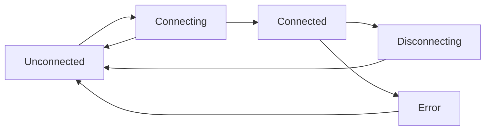

## Overview

Wallet management is at the heart of any Solana dApp. Solana Headless SDK provides a comprehensive system for managing wallet connections, state, and interactions across all supported wallets.

## Wallet Lifecycle



### States

<CardGroup cols={2}>
  <Card title="Unconnected" icon="circle">
    No wallet is connected. User needs to select and connect a wallet.
  </Card>
  <Card title="Connecting" icon="spinner">
    Connection in progress. Waiting for user approval in wallet.
  </Card>
  <Card title="Connected" icon="check-circle">
    Wallet successfully connected. Can perform transactions.
  </Card>
  <Card title="Disconnecting" icon="circle-xmark">
    Disconnection in progress. Cleaning up resources.
  </Card>
</CardGroup>

## Supported Wallets

Solana Headless SDK supports all major Solana wallets through the Wallet Standard and wallet adapters:

### Browser Extension Wallets
- **Phantom** - Most popular Solana wallet
- **Solflare** - Feature-rich wallet
- **Backpack** - xNFT-enabled wallet
- **Coinbase Wallet** - Mainstream crypto wallet
- **Trust Wallet** - Multi-chain wallet
- **Ledger** - Hardware wallet support
- And more...

### Mobile Wallets
- Phantom Mobile
- Solflare Mobile
- Trust Wallet Mobile
- Coinbase Wallet Mobile

### Wallet Standard
Any wallet implementing the [Wallet Standard](https://github.com/wallet-standard/wallet-standard) is automatically supported.

## Wallet Detection

The SDK automatically detects installed wallets and prioritizes them in your UI:

```typescript
import { sortWalletAdapters } from '@hermis/solana-headless-adapter-base';

// Adapters are sorted by:
// 1. Installed wallets (detected in browser)
// 2. Loadable wallets (can be loaded on demand)
// 3. Not detected wallets (not installed)

const sorted = sortWalletAdapters(adapters);
```

### Ready States

<ParamField path="Installed" type="ReadyState">
  Wallet is installed and detected in the user's browser
</ParamField>

<ParamField path="Loadable" type="ReadyState">
  Wallet can be loaded on demand (e.g., WalletConnect)
</ParamField>

<ParamField path="NotDetected" type="ReadyState">
  Wallet is not installed or detected
</ParamField>

<ParamField path="Unsupported" type="ReadyState">
  Wallet is not supported in current environment
</ParamField>

## Connection Management

### Manual Connection

```typescript
// React
import { useWallet } from '@hermis/solana-headless-react';

function ConnectButton() {
  const { connect, select } = useWallet();

  const handleConnect = async () => {
    select('Phantom'); // Select wallet
    await connect();    // Connect to wallet
  };

  return <button onClick={handleConnect}>Connect</button>;
}
```

```javascript
// Vanilla JS
import { WalletAdapterManager } from '@hermis/solana-headless-adapter-base';

const manager = new WalletAdapterManager(adapters);

manager.selectAdapter('Phantom');
await manager.connect();
```

### Auto-Connect

Automatically reconnect to the last used wallet on page load:

```tsx
<HermisProvider autoConnect={true}>
  {children}
</HermisProvider>
```

This provides a seamless experience for returning users.

## Wallet Selection

### Building a Wallet Selector

```tsx
import { useWallet, useWalletAdapters } from '@hermis/solana-headless-react';

function WalletSelector() {
  const { select, connect } = useWallet();
  const { installed, notDetected } = useWalletAdapters();

  return (
    <div>
      <h3>Installed Wallets</h3>
      {installed.map(adapter => (
        <button
          key={adapter.name}
          onClick={() => {
            select(adapter.name);
            connect();
          }}
        >
          {adapter.icon && }
          {adapter.name}
        </button>
      ))}

      <h3>Other Wallets</h3>
      {notDetected.map(adapter => (
        <button
          key={adapter.name}
          onClick={() => window.open(adapter.url, '_blank')}
        >
          {adapter.name} (Not Installed)
        </button>
      ))}
    </div>
  );
}
```

## Persistence

### Local Storage

Wallet selection is automatically persisted to local storage:

```tsx
<HermisProvider
  storageKey="my-app-wallet" // Custom storage key
>
  {children}
</HermisProvider>
```

### Custom Storage

Implement custom storage (e.g., IndexedDB):

```typescript
import { createIndexedDBStorageFactory } from '@hermis/solana-headless-react';

const storage = createIndexedDBStorageFactory('db-name', 'store-name');

<HermisProvider storageFactory={storage}>
  {children}
</HermisProvider>
```

## Multi-Wallet Support

### Switching Wallets

Users can switch between wallets without refreshing:

```typescript
const { wallet, select, disconnect, connect } = useWallet();

const switchWallet = async (newWalletName: string) => {
  await disconnect();  // Disconnect current wallet
  select(newWalletName); // Select new wallet
  await connect();      // Connect to new wallet
};
```

### Multiple Wallet Instances

For advanced use cases, manage multiple wallet connections:

```typescript
const primaryWallet = useWallet();
const secondaryManager = new WalletAdapterManager(adapters);

// Use both for different purposes
```

## Wallet Events

### React

Use hooks to react to wallet changes:

```typescript
const { wallet, connected, publicKey } = useWallet();

useEffect(() => {
  if (connected && publicKey) {
    console.log('Wallet connected:', publicKey.toBase58());
  }
}, [connected, publicKey]);
```

### Vanilla JS

Subscribe to wallet events:

```javascript
manager.on('connect', (publicKey) => {
  console.log('Connected:', publicKey.toBase58());
});

manager.on('disconnect', () => {
  console.log('Disconnected');
});

manager.on('error', (error) => {
  console.error('Error:', error);
});

manager.on('walletChanged', (wallet) => {
  console.log('Wallet changed to:', wallet?.name);
});
```

## Error Handling

### Common Errors

<AccordionGroup>
  <Accordion title="User Rejected (Code 4001)">
    User cancelled the connection in their wallet.
    ```typescript
    if (error.code === 4001) {
      console.log('User rejected the connection');
    }
    ```
  </Accordion>

  <Accordion title="Wallet Not Found">
    Wallet is not installed or not detected.
    ```typescript
    if (adapter.readyState === 'NotDetected') {
      console.log('Please install wallet');
    }
    ```
  </Accordion>

  <Accordion title="Network Mismatch">
    Wallet is connected to different network.
    ```typescript
    // Prompt user to switch network in their wallet
    console.error('Please switch to devnet');
    ```
  </Accordion>

  <Accordion title="Connection Timeout">
    Connection took too long.
    ```typescript
    // Retry or show error message
    console.error('Connection timeout, please try again');
    ```
  </Accordion>
</AccordionGroup>

### Global Error Handler

```tsx
<HermisProvider
  onError={(error, adapter) => {
    console.error(`Error with ${adapter?.name}:`, error);

    // Show user-friendly message
    if (error.code === 4001) {
      showToast('Connection cancelled');
    } else {
      showToast(`Error: ${error.message}`);
    }
  }}
>
  {children}
</HermisProvider>
```

## Best Practices

<AccordionGroup>
  <Accordion title="Always Handle Disconnection">
    Users can disconnect from their wallet extension at any time. Always handle this gracefully:
    ```typescript
    useEffect(() => {
      if (!connected) {
        // Clear user data, redirect, etc.
      }
    }, [connected]);
    ```
  </Accordion>

  <Accordion title="Validate Network">
    Ensure the wallet is connected to the correct network:
    ```typescript
    const { network } = useConnection();
    if (network !== 'mainnet-beta') {
      showWarning('Please switch to mainnet');
    }
    ```
  </Accordion>

  <Accordion title="Provide Visual Feedback">
    Show clear states for connecting, connected, and errors:
    ```typescript
    if (connecting) return <Spinner />;
    if (connected) return <ConnectedUI />;
    return <ConnectButton />;
    ```
  </Accordion>

  <Accordion title="Support Mobile">
    Test on mobile devices and handle deep linking:
    ```typescript
    const isMobile = /iPhone|iPad|iPod|Android/i.test(navigator.userAgent);
    if (isMobile) {
      // Use mobile-specific wallet connection flow
    }
    ```
  </Accordion>
</AccordionGroup>

## What's Next?

<CardGroup cols={2}>
  <Card
    title="Transactions"
    icon="paper-plane"
    href="/core-concepts/transactions"
  >
    Learn about transaction handling
  </Card>
  <Card
    title="Cookbook"
    icon="book-open"
    href="/cookbook/connect-wallet"
  >
    See wallet connection examples
  </Card>
  <Card
    title="API Reference"
    icon="code"
    href="/api-reference/core/wallet-adapter"
  >
    Explore wallet APIs
  </Card>
  <Card
    title="Examples"
    icon="flask"
    href="/examples/vanilla-js"
  >
    View complete implementations
  </Card>
</CardGroup>
